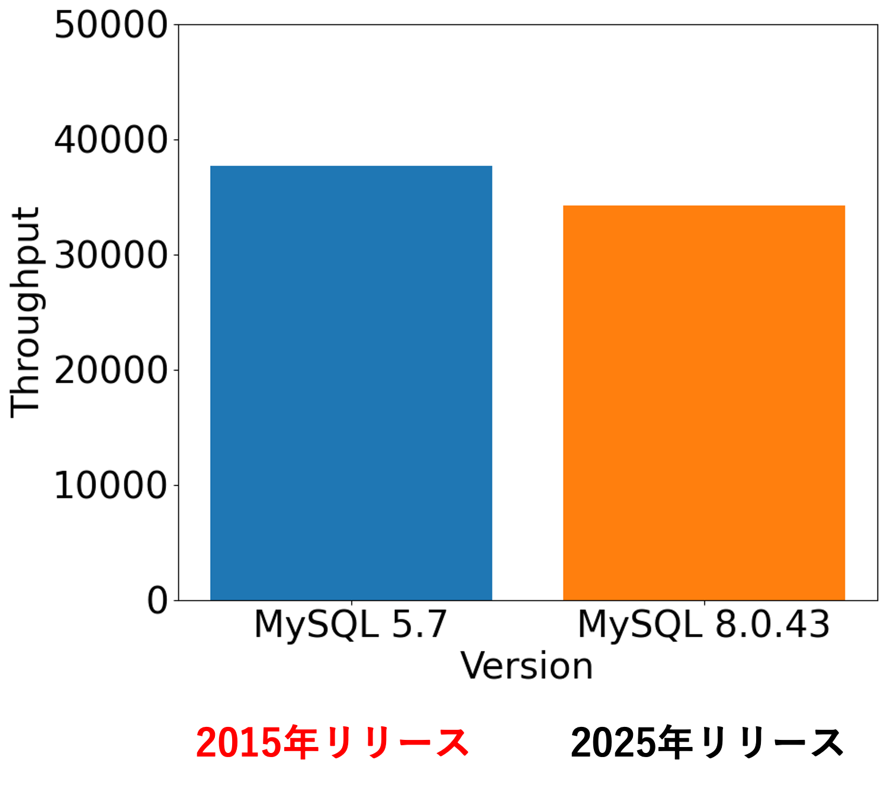
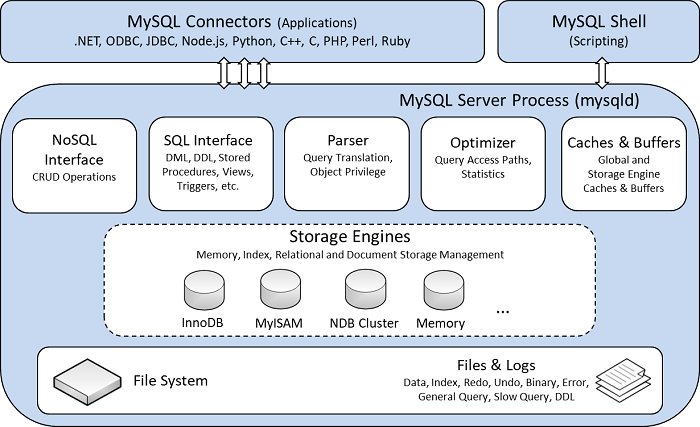
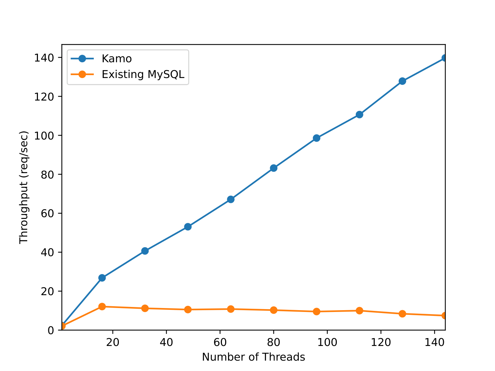

# 高性能で耐故障なMySQL互換DBMS「Kamo」の開発

慶應義塾大学の、宮崎・中森・李です。私たちは、2025年度未踏IT人材発掘・育成事業において、[高性能で耐故障なMySQLの開発](https://www.ipa.go.jp/jinzai/mitou/it/2025/gaiyou-tn-2.html)に取り組みました。
このプロジェクトで我々が開発したのは、MySQL互換DBMS「Kamo」です。Kamoは、近代的な並行性制御によりメニーコア環境で高いスケーラビリティを持つLineairDBをMySQLのストレージエンジンとして統合することで、既存のMySQLを上回る性能と耐故障性を実現しています。

今回の開発では、単に高速なデータベースを作るだけではなく、障害発生時にもサービス継続が可能な構成まで含めて実装と評価を進めました。その過程では、さくらインターネット様のサーバ環境を活用し、分散構成での性能評価や可用性構成の検証を行うことができました。本記事では、Kamoで何を開発したのか、そして開発・評価においてサーバ環境をどのように活用したのかを紹介します。

## なぜMySQL互換DBMSを開発するのか

データベースは、メッセージアプリ、E-commerceサイト、銀行など、社会を支える多様なサービスの基盤として広く利用されています。中でもMySQLは、高いシェアを持つリレーショナルデータベースであり、小規模なサービスから大企業のシステムまで幅広く利用されています。

一方で、近年はサービスの発展に伴ってデータベースに求められる処理性能が増大しています。さらに、災害時やアクセス集中時にも安定して動作し続けることが重要であり、高負荷への対応と継続的なサービス提供の両立が強く求められています。特に現代の計算機環境ではCPUのマルチコア化が進んでおり、その性能を活かせるデータベースの実現が重要です。

しかし、MySQLは1990年代に設計された基盤を引き継いでおり、マルチコア環境への適応が十分とは言えません。私たちの調査では、2025年リリースのMySQL 8.0.43は、2015年リリースのMySQL 5.7と比較して性能がわずかに低下しており、約10年間のバージョン更新を経てもマルチコア環境における性能は改善されていないことが確認されました。

*図1: MySQLの性能の歴史*

そこで本プロジェクトでは、既存アプリケーションとの互換性を維持したまま、高性能化と耐障害性を両立するMySQL互換DBMSを実現することを目標に据えました。

## Kamoとは何か

Kamoは、MySQLで標準的に用いられるInnoDBの代わりに、LineairDBをストレージエンジンとして統合したMySQL互換DBMSです。

LineairDBは、もともと高性能なKey-Valueストアとして設計されており、メニーコア環境で高いスケーラビリティを持つ一方、そのままではRDBMSであるMySQLのストレージエンジンとしては利用できません。そこで私たちは、MySQLのSQLインターフェースを維持しながら、内部ではLineairDBによる高速なトランザクション処理を利用できるようにするための実装を進めました。

さらにKamoでは、MySQL標準のSemi-Synchronous Replicationをサポートし、Failoverによる可用性も付与することで、性能向上に加えて障害時にもサービス継続が可能なMySQL互換DBMSを目指しました。

## 開発で取り組んだ3つのポイント

### 1. LineairDB自体の機能拡張

プロジェクト開始時点のLineairDBは、Read、Write、Scanといった基本APIを備えていた一方で、RDBMSに必要なテーブル管理機構やSecondary Indexを持っていませんでした。

そこで、複数テーブルを明示的に扱うためのTable機構を実装するとともに、Insert、Update、Deleteなどの操作を追加しました。さらに、主キー以外の条件による検索を可能にするSecondary Indexを実装し、その更新・削除・範囲検索において整合性が保たれるよう拡張しました。

これにより、LineairDBを単なるKey-Valueストアから、RDBMSのストレージエンジンとして利用可能な基盤へ発展させました。

### 2. MySQLとLineairDBを接続するhandlerの実装

MySQLは、サーバ層とストレージエンジン層が分離された構造を持っており、SQLの実行結果はhandlerインターフェースを通じてストレージエンジンに伝達されます。

*図2: MySQLのプラガブルストレージエンジンアーキテクチャ（出典: [MySQL Reference Manual](https://dev.mysql.com/doc/refman/8.0/ja/pluggable-storage-overview.html)）*

そのためKamoを実現するには、MySQLから受け取ったテーブル操作やレコード操作をLineairDBのAPIに変換するhandlerが必要でした。そこでこのhandlerを実装することで、MySQL互換のSQLインターフェースを維持したまま、内部ではLineairDBによる高速なトランザクション処理を利用できるようにしました。

### 3. 耐障害性と可用性を付与する構成の実装

可用性の実現にあたっては、当初Raftの導入も検討しました。しかし、MySQL本体への大規模な改変が必要であり、開発期間内での実現可能性を踏まえて方針を変更しました。

最終的には、MySQL標準のSemi-Synchronous Replicationを採用し、さらにOrchestratorによるPrimary障害の自動検知とReplicaの昇格、ProxySQLによる接続先制御を組み合わせることで、自動Failoverを実現しました。これにより、障害発生時にもサービスを継続可能な構成を整備しました。

## さくらインターネットのサーバ環境で行ったこと

今回の開発・評価では、さくらインターネット様のサーバ環境を活用し、Kamoの性能と可用性を分散構成で検証しました。

評価に用いたDBノードは3台構成で、Primary 1台、Replica 2台を配置しています。各ノードの構成は以下の通りです。

*表1: 実験環境（DBノード）*

| 項目 | 内容 |
|------|------|
| 構成 | DBノード3台（Primary 1台 + Replica 2台、同一スペック） |
| CPU | AMD EPYC 9654P 96-Core Processor（192 vCPU） |
| メモリ | 1.0 TiB |
| ストレージ | 1 TB（実効容量993 GB） |
| OS | Ubuntu 22.04.5 LTS |
| カーネル | Linux 5.15.0-119-generic |
| 仮想化基盤 | KVM（仮想マシン） |
| レプリケーション方式 | MySQL Semi-Synchronous Replication |

また、接続先制御のためにProxySQLノードも用意しました。

*表2: ProxySQLノードの構成*

| 項目 | 仕様 |
|------|------|
| CPU | Intel Xeon Gold 6212U @ 2.40GHz（20 vCPU） |
| メモリ | 31 GiB |
| ストレージ | 約500 GB（実効容量約405 GB） |
| OS | Ubuntu 22.04.5 LTS |
| カーネル | Linux 5.15.0-121-generic |

この環境を使うことで、単一ノードの動作確認にとどまらず、Primary / Replicaを含むMySQL互換DBMSの実運用に近い構成で、性能評価と自動Failoverを含む可用性構成の検証を進めることができました。特に、多数のCPUコアを持つ環境で評価できたことにより、Kamoが目指す「メニーコア時代の次世代データベース」としての特性を検証できた点は大きかったと考えています。

## TPC-Cワークロードでの評価

以上の開発により、KamoはMySQL互換のインターフェースを維持したまま、業界標準のOLTPベンチマークであるTPC-Cワークロードを実行可能なシステムとなりました。TPC-Cを実行できることは、単に基本的なSQL処理が可能であることにとどまらず、複数テーブル、更新処理、索引アクセスを含む実用的なトランザクション処理を支えられることを示すうえで重要です。

そこで、開発したKamoについて、TPC-Cワークロードを用いて既存のMySQLと性能比較を行いました。その結果、KamoはProxySQLを含む分散構成の環境において、既存のMySQLに対して最大18.7倍の性能を示しました。

*図3: ProxySQL構成におけるTPC-CワークロードでのKamoと既存のMySQLの比較*

この結果は、MySQL互換性を維持しながら、既存のMySQLでは十分に活かしきれなかったマルチコア環境での高並列処理性能を引き出せる可能性を示しています。既存アプリケーション資産を活かしたまま性能改善を図れる点は、Webサービス、E-commerce、金融系システム、企業情報システムなど、MySQLを利用する幅広い分野にとって意義があると考えています。

## 従来技術と比べた新しさ

従来のMySQLは、成熟した互換性と豊富な利用実績を持つ一方で、マルチコア環境におけるスケーラビリティには改善の余地があります。本プロジェクトの特徴は、そのMySQLを置き換えるのではなく、プラガブルストレージエンジン機構を活用することで、MySQL互換のまま高性能化を図った点にあります。

また、単にLineairDBを接続しただけではなく、RDBMSに必要なTable、Insert / Update / Delete、Secondary Index、範囲検索機能などを新たに実装し、MySQLのhandlerと接続することで、SQLから利用できるようにしました。つまり、高性能なKey-ValueストアをMySQL互換DBMSのストレージエンジンとして成立させるために必要な機能群を実装したことが、本プロジェクトの新規性です。

さらに、耐障害性についても、既存のMySQLレプリケーション機構にProxySQLとOrchestratorを組み合わせることで、自動Failoverを含む実運用可能な構成を実現しました。これは単なるベンチマーク用試作にとどまらず、高性能性と可用性の両立を目指した実践的なシステム開発であると考えています。

## 今後の展望

本プロジェクトで開発したKamoは、MySQL互換のSQLインターフェースを維持しつつ、高性能化と耐障害性の向上を目指したDBMSです。そのため、既存のMySQLを利用している開発者や運用者にとって、比較的導入を検討しやすい構成になっています。特に、高負荷なOLTP処理を扱うWebサービス、E-commerce、業務システムなどにおいて、既存アプリケーション資産を活かしたまま性能改善を図る手段としての可能性があります。

今後は、OSSとしての公開に向けて、導入方法や制約事項を含むドキュメント整備を進めるとともに、性能評価結果や運用手順を整理し、利用しやすい形で提供していく予定です。さらに、学会や技術コミュニティでの発表を通じて認知を広げることで、研究用途に加えて、実サービス基盤への適用可能性も高めていきたいと考えています。

MySQLの互換性を保ちながら内部実装を刷新し、高性能性と可用性の両立を目指す取り組みは、今後の高性能DBMSや高可用データベース基盤の研究開発においても、有用な事例になるはずです。Kamoの開発を通じて得られた知見を、今後さらに発展させていきます。

## 関連リンク

ソースコード: 
- [LineairDB-storage-engine（GitHub）](https://github.com/mitou-Kamo/LineairDB-storage-engine)
- [LineairDB（GitHub）](https://github.com/LineairDB/LineairDB)

参考文献:
- [MySQL Pluggable Storage Engine Architecture（MySQL Reference Manual）](https://dev.mysql.com/doc/refman/8.0/ja/pluggable-storage-overview.html)

